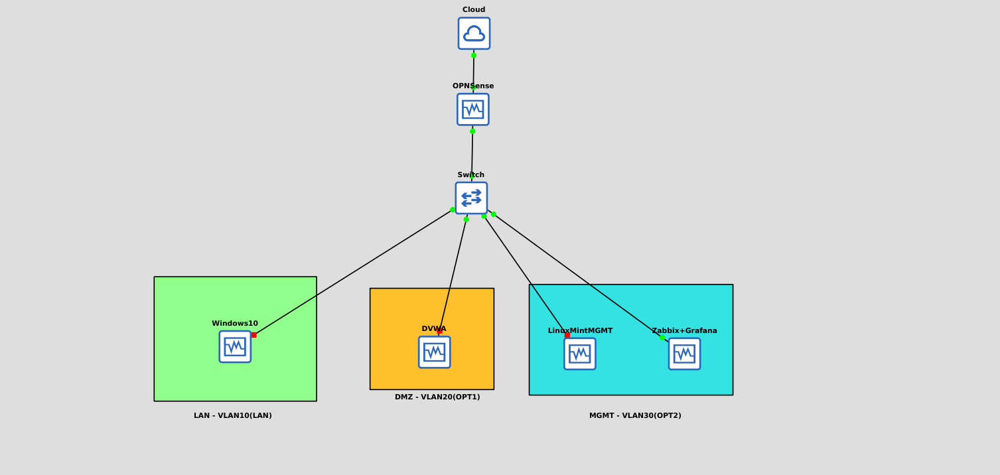
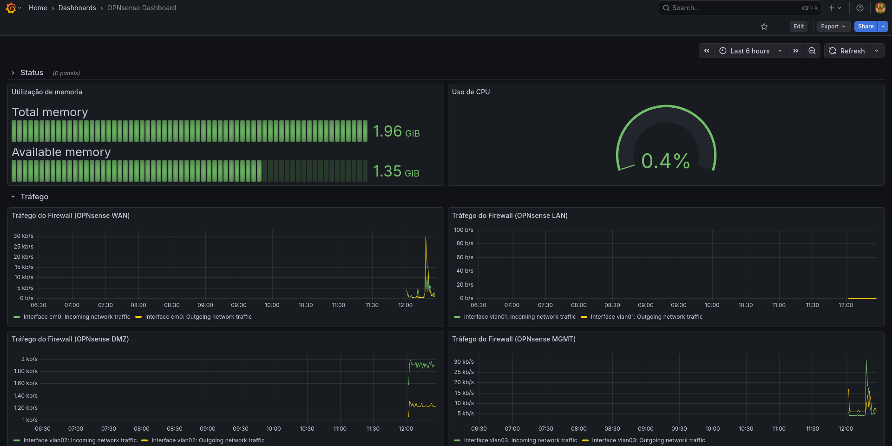

# 🛡️ Projeto de Infraestrutura e Segurança (NOC)

> Um laboratório prático de implementação de segurança de rede, segmentação, VPN com MFA e monitoramento contínuo (NOC).

---

## 📂 Índice

- [1. Descrição e Cenário](#1-descrição-e-cenário)
- [2. Arquitetura e Topologia](#2-arquitetura-e-topologia)
- [3. Ferramentas Utilizadas](#3-ferramentas-utilizadas)
- [4. Implementação e Hardening](#4-implementação-e-hardening)
    - [4.1 Segmentação de Rede (VLANs)](#41-segmentação-de-rede-vlans)
    - [4.2 Configuração do Firewall (OPNsense)](#42-configuração-e-regras-de-firewall-hardening)
    - [4.3 Acesso Remoto Seguro (VPN + MFA)](#43-acesso-remoto-seguro-vpn--mfa)
    - [4.4 Monitoramento e Orquestração](#44-monitoramento-e-orquestração-docker)
- [5. Testes e Evidências](#5-testes-e-evidências)
- [6. Conclusão](#6-conclusão)

---

## 1. Descrição e Cenário

O objetivo deste projeto foi simular a infraestrutura de uma pequena empresa que necessita elevar seu nível de maturidade em segurança. O ambiente precisava sair de uma rede "flat" (sem segregação) para uma rede segmentada, conteinerizada e monitorada.

**Os requisitos do projeto foram:**
1.  Isolar serviços públicos (DMZ) da rede interna (LAN).
2.  Criar uma rede de gerenciamento (MGMT) restrita.
3.  Permitir que administradores acessem a rede remotamente de forma segura.
4.  Monitorar a disponibilidade, integridade e performance de todos os ativos.

---

## 2. Arquitetura e Topologia

O laboratório foi virtualizado inteiramente no **GNS3**, integrando máquinas virtuais e containers Docker.

A topologia segue o modelo de defesa em profundidade:
* **Edge:** OPNsense atuando como Firewall e Gateway.
* **Switch Core:** Gerenciamento de VLANs (802.1Q).
* **Endpoints:** Windows 10 (Usuário), Linux Mint (Admin), Docker Hosts (Serviços e Monitoramento).

---

## 3. Ferramentas Utilizadas

| Categoria | Ferramenta | Descrição |
| :--- | :--- | :--- |
| **Firewall** | OPNsense | Distribuição baseada em HardenedBSD com plugin nativo de monitoramento. |
| **Simulador** | GNS3 | Utilizado para emular o hardware de rede e conexões. |
| **Orquestração** | Docker Compose | Gerenciamento de stacks de serviços e agentes via código (IaC). |
| **Monitoramento** | Zabbix 7.0 + Grafana | Coleta de métricas (Active/Passive) e visualização de dados. |
| **Segurança** | OpenVPN + MFA | VPN SSL com autenticação de dois fatores (OTP). |
| **Alvo** | DVWA | *Damn Vulnerable Web App* simulando servidor de produção na DMZ. |

---

## 4. Implementação e Hardening

### 4.1 Segmentação de Rede (VLANs)
Para reduzir a superfície de ataque, a rede foi dividida em zonas lógicas:

| ID | Nome | Subrede | Função |
| :--- | :--- | :--- | :--- |
| **10** | `LAN` | `10.10.10.0/24` | Rede de estações de trabalho. Acesso à Internet permitido, acesso à DMZ bloqueado. |
| **20** | `DMZ` | `10.10.20.0/24` | Rede de serviços expostos (DVWA). Isolada da LAN e MGMT (com exceção de monitoramento). |
| **30** | `MGMT` | `10.10.30.0/24` | Rede crítica de gerenciamento. Contém o stack Zabbix/Grafana. Acessível apenas via VPN ou Admin autorizado. |

### 4.2 Configuração e Regras de Firewall (Hardening)

A política de segurança foi desenhada seguindo o princípio do "Least Privilege". Foi aplicada uma lógica rigorosa de **"First Match"** para permitir o monitoramento sem quebrar o isolamento da DMZ:

| Interface | Ação | Origem | Destino | Porta/Protocolo | Propósito |
| :--- | :---: | :--- | :--- | :--- | :--- |
| **DMZ** | ✅ ALLOW | DVWA Host | Zabbix Server | 10051 (TCP) | **Exceção de Monitoramento:** Permite apenas o envio de métricas do Agente (Active) para o Server. |
| **DMZ** | ✅ ALLOW | DMZ Net | This Firewall | 53 (TCP/UDP) | **Infraestrutura:** Garante resolução de DNS antes das regras de bloqueio. |
| **DMZ** | 🚫 BLOCK | DMZ Net | MGMT Net | Any | **Proteção Crítica:** Impede acesso lateral à rede de gerenciamento. |
| **DMZ** | 🚫 BLOCK | DMZ Net | This Firewall | Any | **Gerência Segura:** Bloqueia tentativas de acesso à GUI/SSH do Firewall. |
| **DMZ** | 🚫 BLOCK | DMZ Net | LAN Net | Any | **Anti-Pivoting:** Isola a DMZ da rede de usuários. |
| **DMZ** | ✅ ALLOW | DMZ Net | Any | 80, 443 (TCP) | **Saída Controlada:** Permite apenas tráfego web (updates) via Alias de portas, bloqueando portas altas/suspeitas. |

### 4.3 Acesso Remoto Seguro (VPN + MFA)
Foi configurado um servidor **OpenVPN** dentro do OPNsense para acesso administrativo.

* **Protocolo:** UDP/1194.
* **Criptografia:** AES-256-CBC.
* **Autenticação:** Usuário Local + Token OTP (Time-based One-Time Password).

> 🔒 **Configuração de Segurança:** A VPN entrega uma rota estática apenas para a subrede `10.10.30.0/24` (MGMT), impedindo acesso desnecessário à LAN.

### 4.4 Monitoramento e Orquestração (Docker)

Todo o ambiente de monitoramento foi implantado utilizando **Docker Compose**, garantindo reprodutibilidade.

**1. Stack de Monitoramento (VLAN MGMT):**
* **Zabbix Server 7.0 LTS:** Backend de coleta com banco de dados MySQL.
* **Self-Monitoring:** Implementado container `zabbix-agent` (Alpine) dentro do stack para monitorar a saúde do próprio servidor.

**2. Monitoramento da DMZ (Active Agent Pattern):**
* O servidor web (DVWA) roda acompanhado de um container **Zabbix Agent 2** no mesmo arquivo `docker-compose.yml`.
* **Configuração Avançada**: Utilizado network_mode: "host" e mapeamento do docker.sock para permitir que o agente monitore o host real e os containers vizinhos.
* **Modo Active:** Devido ao bloqueio de firewall (MGMT não inicia conexões para DMZ), o agente foi configurado como **Active**, iniciando a conexão de fora para dentro na porta 10051.

**3. Monitoramento do Firewall:**
* Instalação do plugin nativo `os-zabbix-agent` (FreeBSD) no OPNsense, reportando métricas de hardware e tráfego diretamente para o servidor.

---

## 5. Testes e Evidências

Aqui estão as comprovações do funcionamento do laboratório.

### 📸 1. Conexão VPN com MFA
*Demonstração do pedido de Token OTP ao conectar na VPN:*

### 📸 2. Regras de Firewall e Hardening
*Configuração de "First Match" garantindo funcionamento do Zabbix e bloqueio de movimentação lateral:*

### 📸 3. Dashboards de Operação (NOC)
***A. Visão de Infraestrutura (OPNsense):** Foco em saúde do hardware (CPU/RAM) e fluxo de tráfego de rede (WAN/LAN/DMZ).*

***B. Visão de Serviço (DVWA):** Monitoramento focado na aplicação: Disponibilidade HTTP (Status 200) e saúde do container Docker.*

---

## 6. Conclusão

Este projeto permitiu consolidar conhecimentos em **Defesa Cibernética**, **Docker** e **Redes**. O principal desafio foi orquestrar a comunicação entre containers em VLANs isoladas, exigindo configurações finas de Firewall (regras de exceção) e o uso estratégico de Zabbix Agents em modo Ativo vs Passivo. O resultado é um ambiente seguro, segmentado e com observabilidade total.

---

**Autor:** THIAGO COSTA
*Conecte-se comigo no [LinkedIn](https://www.linkedin.com/in/thiagobovocosta/)*
